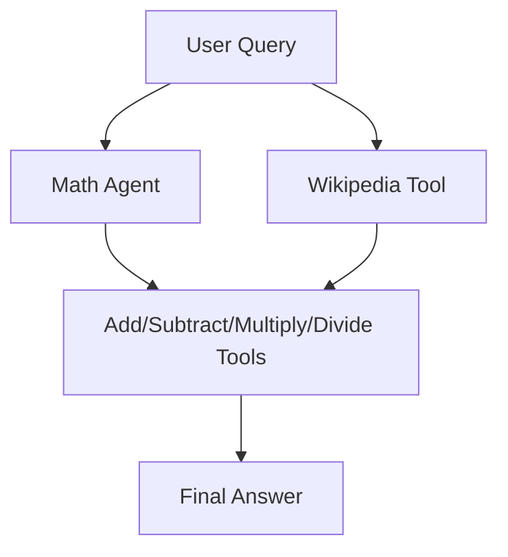

# 🧮 Artificial Intelligence – Math & Knowledge Assistant

[](https://github.com/Raul-Dumitrele/Artificial-Intelligence/actions)


> Un asistent inteligent AI care combină calcule matematice avansate cu căutare de informații factuală, ideal pentru utilizatori și dezvoltatori care vor precizie și modularitate.

---

## 🚀 Ce face acest proiect

- Operații matematice de bază: adunare, scădere, înmulțire, împărțire  
- Suport pentru numere negative și zecimale  
- Extrage numere din texte și le calculează automat  
- Integrare cu Wikipedia pentru răspunsuri factuale  
- Agenți modeşti: poți adăuga / modifica tool-uri fără să strici restul codului  
- Set complet de teste automate care acoperă cazuri normale și edge‑cases  

---

## 🏗️ Arhitectura



---

## 🔧 Cum se instalează

```bash
git clone https://github.com/Raul-Dumitrele/Artificial-Intelligence.git
cd Artificial-Intelligence
pip install -r requirements.txt
```

---

## ⚙️ Configurare

Setează cheia ta de API în variabila de mediu:

```bash
export OPENAI_API_KEY="YOUR_API_KEY_HERE"
```

Sau în Python:

```python
import os
os.environ["OPENAI_API_KEY"] = "YOUR_API_KEY_HERE"
```

---

## 🧪 Cum se folosește

### Teste

```bash
python Math AI.py
```

Ar trebui să vezi output‑uri care confirmă că tool‑urile sunt funcționale (adunare, scădere, Wikipedia, etc.), și validări că erorile (ex. împărțire la zero) sunt gestionate.

### Exemplu interactiv

```python
from Math_AI import math_agent

response = math_agent.invoke({"messages": [("human", "Add 15, -5, and 3.2")]})
print(response["messages"][-1].content)
```

---

## 📂 Structura proiectului

```
Artificial-Intelligence/
├── Math AI.py           # implementarea principală
├── MathAI v1.py         # versiune veche / variantă
├── requirements.txt     # biblioteci / dependențe
└── README.md            # acest fișier
```

---

## 🧠 Tehnologii folosite

| Componentă         | Rol                                                                 |
|--------------------|----------------------------------------------------------------------|
| **Python 3.10+**   | Limbajul principal de implementare                                  |
| **LangChain**      | Gestionare tool-uri & agenți                                         |
| **LangGraph**      | (dacă e folosit) pentru agenți reactivi / reasoning pe pași         |
| **OpenAI GPT‑4.1** | LLM‑ul principal pentru generare și înțelegere                       |
| **Wikipedia API**  | Căutare și răspunsuri actualizate                                   |

---

## 🤝 Contribuții

Contribuțiile sunt binevenite—fie că vrei să adaugi tool-uri, să îmbunătățești testele sau să optimizezi codul:

1. Fork repo  
2. Creează branch nou (`feature/nume-feature`)  
3. Fă commit la modificările tale  
4. Trimite un Pull Request  

---


## 📌 Coduri recomandate (FAQ)

**Întrebare:** Ce se întâmplă când un număr nu este recunoscut într‑un text?  
**Răspuns:** Cuvintele care nu pot fi convertite în numere vor fi ignorate; operațiile vor fi realizate pe restul numerelor valide.

**Întrebare:** Se poate rula offline?  
**Răspuns:** Nu, pentru că este nevoie de acces la API‑ul OpenAI și la serviciul Wikipedia (online).

---

## ⭐ Dacă îți place proiectul

Lasă un ⭐ pe GitHub — ajută proiectul să fie vizibil!

---

## Authon Name:

[Raul Dumitrele](https://github.com/Raul-Dumitrele)
